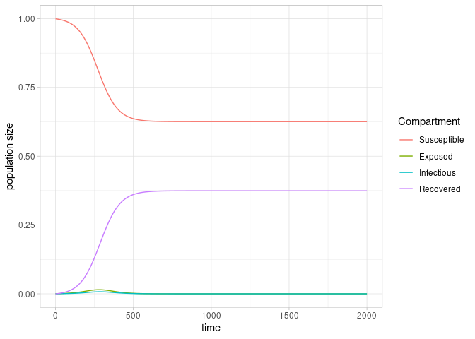
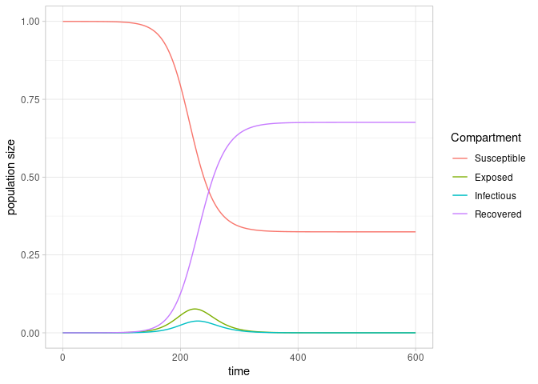

<!-- README.md is generated from README.Rmd. Please edit that file -->
<!-- badges: start -->

[](https://mybinder.org/v2/gh/rivm-syso/escape2024/main?urlpath=rstudio)
<!-- badges: end -->

# escape2024

## Description

This repository contains parts of the code used for the deliverable D4.1
of the [ESCAPE project](https://www.escapepandemics.com/), 2024. The
code is written primarily in the programming language R. The repository
contains code and examples of the estimators for the latent and
infectious period of section 3 and code to produce table 1, 2 and
figures 4, 5. The package simulates deterministic SEIR epidemics for the
mass action model and configuration network model that are described by
ordinary differential equations. The code contains functionality to
calculates theoretical basic reproduction number and final size for the
epidemic models. The theory underlying the SEIR configuration network
model are described in \[1\]. To build an interactive Rstudio
environment to reproduce the results, click the binder badge at the top
of the README.

\[1\] Leung, K.Y., Diekmann, O. Dangerous connections: on binding site
models of infectious disease dynamics. *J. Math. Biol.* 74, 619–671
(2017). <https://doi.org/10.1007/s00285-016-1037-x>

## Installation

The `escape2024` functionality can be installed as a package (requires
the package `pak`):

    pak::pak("rivm-syso/escape2024")

## Usage

Tables and figures from the ESCAPE deliverable report can be produced
from the R scripts in `deliverable_2024`. The resulting tables and
figures are stored in the folder `results` as csv files (tables) and png
files (figures). The code regarding estimators for latent and infectious
periods is included as a Mathematica notebook
`estimators_latent_infectious_period.nb`, for completeness a PDF of the
notebook is included (non-Mathematica users can open the notebook with
the free [Wolfram
Player](https://reference.wolfram.com/language/howto/DeployANotebookForPlayer.html.en).

Functions in the escape2024 are available to simulate epidemics for the
mass action and configuration network reference models, together with
the calculation of the theory basic reproduction number and final size
(coinciding with the simulated final size).

Example usage is shown below for the mass action model and configuration
model.

``` r
library(escape2024)
```

``` r
# default parameters
data <- model_reference(
  transmission_rate = 0.25,
  infectiousness_rate = 0.1,
  recovery_rate = 0.2,
  time_end = 2000,
  population_size = 1,
  seed_infected = 1E-3,
  increment = 1
)
# put parameters in list for convenience
params <- list(
  transmission_rate = 0.25,
  infectiousness_rate = 0.25,
  recovery_rate = 0.2,
  time_end = 400,
  population_size = 1,
  seed_infected = 1E-3
)
```

Plot the course of the epidemic for the four compartments

``` r
plot_epidemic(data)
```

<!-- -->

The final size of the epidemic is defined as the fraction of individuals
that are susceptible at the start of the epidemic and are ultimately
infected, as fraction of the total population size

``` r
final_z <- final_size(data)
final_number <- final_z * params$population_size
```

As a fraction of the total population, the fraction ultimately infected
is 0.3733.

We can also calculate epidemiological quantities from theory. The
reproduction number is

``` r
theory_reference_reproduction_number(params)
#> [1] 1.25
```

The final size is

``` r
theory_final_z <- theory_reference_final_size(params)
theory_final_z
#> [1] 0.3713702
```

where the desired accuracy is machine precision: 2.220446^{-16}. Note
the correspondence in theoretical and simulated final size: 0.3713702 vs
0.3732748.

We can similarly simulate the configuration network model and calculate
epidemiological quantities. Create object for simulating SEIR epidemic
on network with Poisson degree

``` r
data_network <- model_network(
  degree_distribution = "poisson",
  infection = "SEIR",
  transmission_rate = 0.25,
  infectiousness_rate = 0.1,
  recovery_rate = 0.2,
  time_end = 600,
  increment = 1,
  population_size = 1,
  seed_infected = 1E-5,
  lambda = 3
)
```

Plot epidemic outbreak

``` r
plot_epidemic(data_network)
```

<!-- -->

From the simulations the final size is

``` r
z <- final_size(data_network)
z
#> [1] 0.6757466
```

Assign parameter values to variables for use in functions to calculate
$R_0$ and the final size

``` r
network_params <- attr(data_network, "parameters")
network_infection <- attr(data_network, "infection")
network_degree <- attr(data_network, "degree")
```

and calculate the reproduction number and final size for the
configuration network model

``` r
reproduction_theory <- theory_network_reproduction_number(network_infection, network_params, network_degree)

final_size_network_theory <- theory_network_final_size(network_params, network_degree, network_infection, .fraction = TRUE)
final_size_network_theory$final
#> [1] 0.6757467
```

The theoretical reproduction number is 1.67 and the theoretical final
size is 0.6757 (compare to the simulated final size 0.6757).

## Requirements

All R code is developed and tested with the following R session info:

    R version 4.4.1 (2024-06-14)
    Platform: x86_64-redhat-linux-gnu
    Running under: Red Hat Enterprise Linux 8.10 (Ootpa)

    Matrix products: default
    BLAS/LAPACK: /usr/lib64/libopenblaso-r0.3.15.so;  LAPACK version 3.9.0

    locale:
     [1] LC_CTYPE=en_US.UTF-8       LC_NUMERIC=C              
     [3] LC_TIME=en_US.UTF-8        LC_COLLATE=en_US.UTF-8    
     [5] LC_MONETARY=en_US.UTF-8    LC_MESSAGES=en_US.UTF-8   
     [7] LC_PAPER=en_US.UTF-8       LC_NAME=C                 
     [9] LC_ADDRESS=C               LC_TELEPHONE=C            
    [11] LC_MEASUREMENT=en_US.UTF-8 LC_IDENTIFICATION=C       

    time zone: Europe/Amsterdam
    tzcode source: system (glibc)

    attached base packages:
    [1] stats     graphics  grDevices utils     datasets  methods  
    [7] base     

    loaded via a namespace (and not attached):
     [1] miniUI_0.1.1.1    compiler_4.4.1    promises_1.3.0   
     [4] Rcpp_1.0.13       callr_3.7.6       later_1.3.2      
     [7] fastmap_1.2.0     mime_0.12         R6_2.5.1         
    [10] knitr_1.48        htmlwidgets_1.6.4 tibble_3.2.1     
    [13] profvis_0.4.0     shiny_1.9.1       pillar_1.9.0     
    [16] rlang_1.1.4       utf8_1.2.4        cachem_1.1.0     
    [19] xfun_0.47         httpuv_1.6.15     fs_1.6.4         
    [22] pkgload_1.4.0     memoise_2.0.1     cli_3.6.3        
    [25] withr_3.0.2       magrittr_2.0.3    ps_1.8.0         
    [28] processx_3.8.4    digest_0.6.35     rstudioapi_0.16.0
    [31] xtable_1.8-4      remotes_2.5.0     devtools_2.4.5   
    [34] lifecycle_1.0.4   vctrs_0.6.5       evaluate_1.0.0   
    [37] glue_1.8.0        urlchecker_1.0.1  sessioninfo_1.2.2
    [40] pkgbuild_1.4.4    fansi_1.0.6       rmarkdown_2.28   
    [43] purrr_1.0.2       tools_4.4.1       usethis_3.0.0    
    [46] pkgconfig_2.0.3   ellipsis_0.3.2    htmltools_0.5.8.1

The Mathematica notebook is developed under Wolfram Mathematica version
14.0 Desktop for Windows.

## License

Copyright (c) 2024 Rijksinstituut voor Volksgezondheid en Milieu (RIVM),
licensed under the EUPL v1.2

## Funding

This work is part of the ESCAPE project (101095619), funded by the
European Union

## Feedback

If you encounter a clear bug, please file an issue with a minimal
reproducible example on GitHub.
